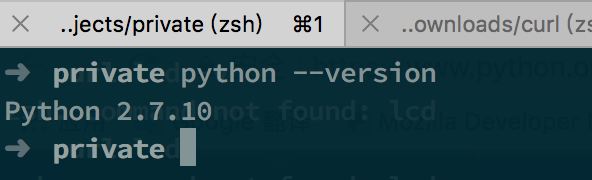
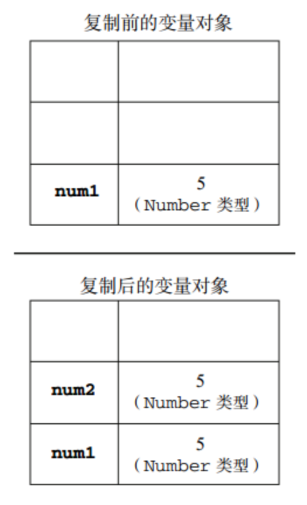
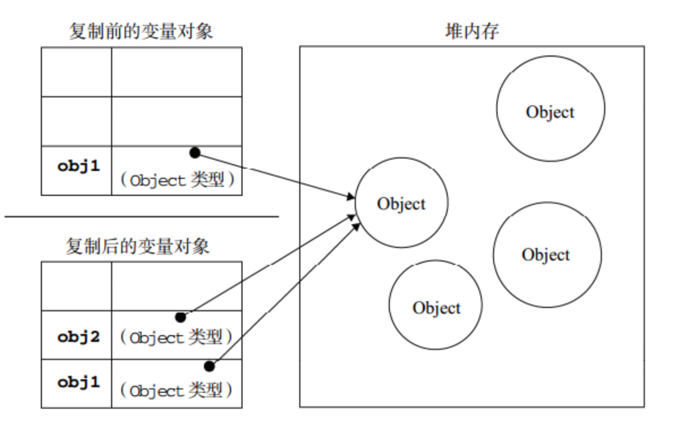
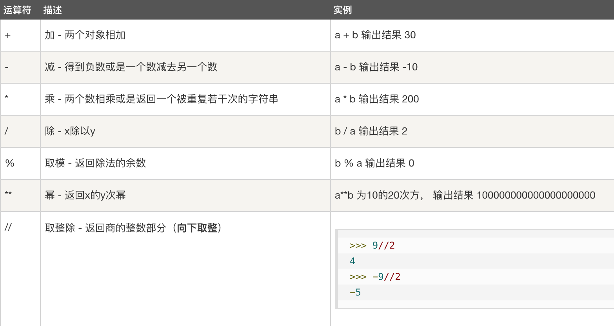
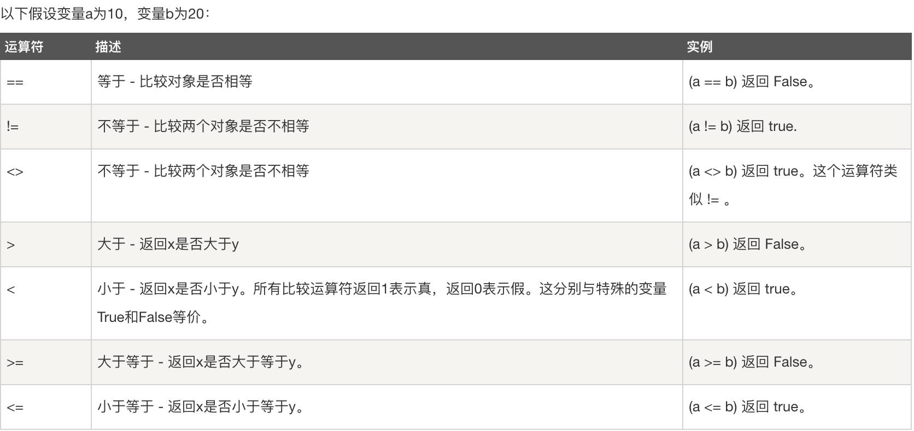
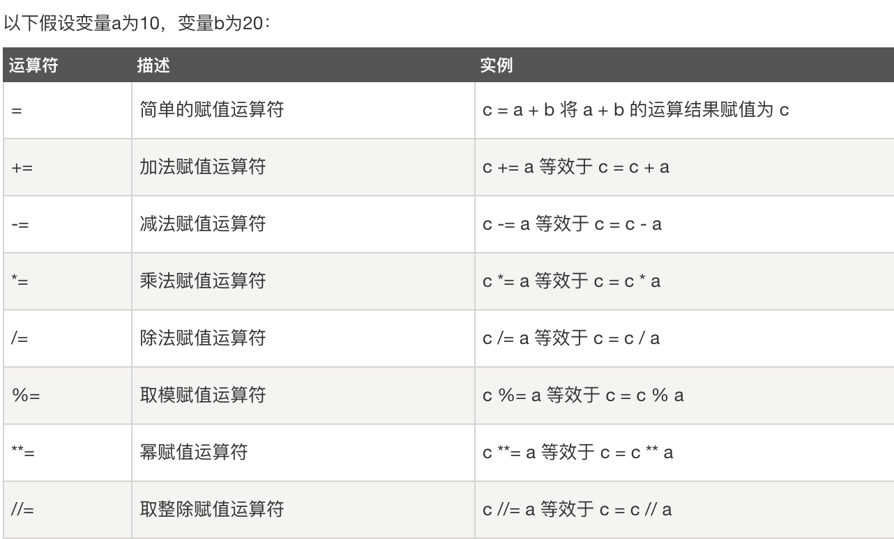
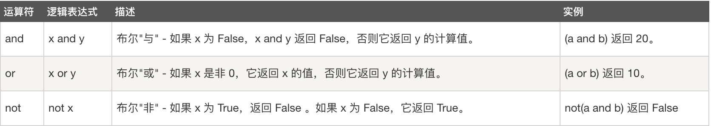
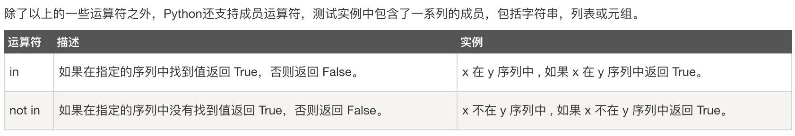
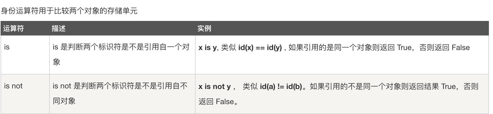
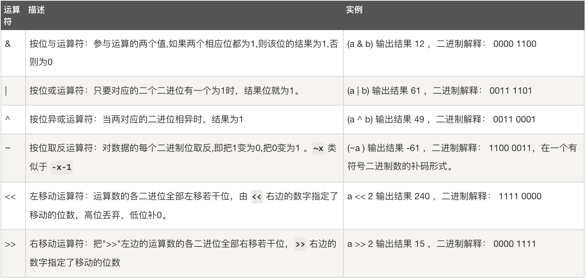

# Python基础部分

## 安装Python环境

### 下载及安装

官网下载地址：`https://www.python.org/downloads/`，找到对应系统的安装包，windows为`.exe`文件，macos为`.dmg`文件。下载完成后，执行即可


在命令行窗口里输入`python --version`验证是否安装成功



### 设置环境变量

一般来说，执行完安装包就可以直接在命令行窗口里使用`python命令`了，有的时候会报错，这是没有环境变量没有设置成功导致的

`环境变量`告诉操作系统去哪里找你输入的命令

windows设置环境变量

macos设置环境变量

## 基础语法

### 基础数据类型

1. 引用类型和非引用类型
    1. Number和String是非引用类型
    2. 引用类型和非引用类型的区别
        1. 非引用类型
            ```python
            num = 5
            num = 4
            ```

            
        2. 引用类型
            ```python
            obj1 = { "a": 1}
            obj2 = obj1
            ```

            
    3. 问题：如何比较两个List变量是否指向同一个对象

2. python的基础数据类型
    1. Number
        1. 类型
            1. int
            2. long
            3. float
            4. complex
        2. 内建方法：`http://www.runoob.com/python/python-numbers.html`

    2. 问题：不同类型之间如何转换
    2. String
        1. 运算符
            1. s1 + s2 连接符
            2. s1 * 2 重复
            3. s1[1] 取单个字符
            4. s1[1:4] 截取
            5. % 格式化输出

                ```python
                print "My name is %s and weight is %d kg!" % ('Zara', 21) 
                # output: My name is Zara and weight is 21 kg!
                ```
        2. 内建方法 `http://www.runoob.com/python/python-strings.html`
            1. 如何查阅api文档
                1. api语法
                2. 入参
                3. 返回值
            
                ```python
                str = 'nishizhu'
                print str.find('zhu') # 5
                ````
        3. 问题：倒序一个字符串
    3. Tuple
        1. 声明方式: t = (1, 2, 3)
        2. 只读
    4. List
        1. 声明方式: l = [1, 2, 3]
        2. 内建方法 `http://www.runoob.com/python/python-lists.html`
    5. Dictionary
        1. 声明方式: d = { "a" : 1}
        2. 内建方法 `http://www.runoob.com/python/python-dictionary.html`
    6. Boolean 不算在基本类型中 True or False

### 循环与条件语句

1. for 循环
    1. 通过索引迭代

        ```python
        arr = ['a', 'b', 'c']
        for i in range(len(arr)):
            print i
            print arr[i]
        ```
    2. 使用break跳出整个循环

        ```python
        arr = ['a', 'b', 'c']

        for i in range(len(arr)):
            if i > 1:
                break

            print i
            print arr[i]
        ```
2. while 循环
    1. 基础用法

        ```python
        arr = ['a', 'b', 'c']

        while len(arr) > 0:
            print str(arr)
            del arr[0]

        print 'out of loop'
        ```
    2. 使用continue跳出本次循环

        ```python
        count = 5
        while count > 0:
            count -= 1

            if count == 1:
                continue

            print count

        print 'out of loop'
        ```
3. if elif else

### 运算符

1. 算术运算符

    
2. 比较运算符

    

3. 赋值运算符

    

4. 逻辑运算符

    并且、或者、非

    

5. 成员运算符

    

6. 身份运算符

    

4. 位运算符

    

    一个用法case：

### 函数与lambda表达式

1. 函数的组成
    1. def
    2. 参数
        1. 形参和实参
        2. 引用变量和非引用变量作为参数传入，引用变量可变
        3. 参数类型
            1. 必备参数

                ```python
                def sayHi(words):
                    print words
                
                sayHi() # 报错
                ```
            2. 关键字参数，可以自由变换顺序

                ```python
                def sayHi(name, words):
                    print name + ' said: ' + words

                sayHi(words='hi', name='may') # may said: hi 
                ```
            3. 默认参数

                ```python
                def sayHi(words, name = 'yds'):
                    print name + ' said: ' + words

                sayHi(words='hi') # yds said: hi
                ```
            4. 不定长参数

                ```python
                def sayHi(name, *words):
                    print name + ' said:' 
                    
                    for w in words:
                        print w

                sayHi('may', 'hi', 'there')
                ```
    3. return

        ```python
        def sayHi(name, words):
            return name + ' said: ' + words

        str = sayHi('may', 'hi')
        print str
        ```

### 模块

### 异常处理

### 位运算

## 断点调试

## 代码风格

## 习题